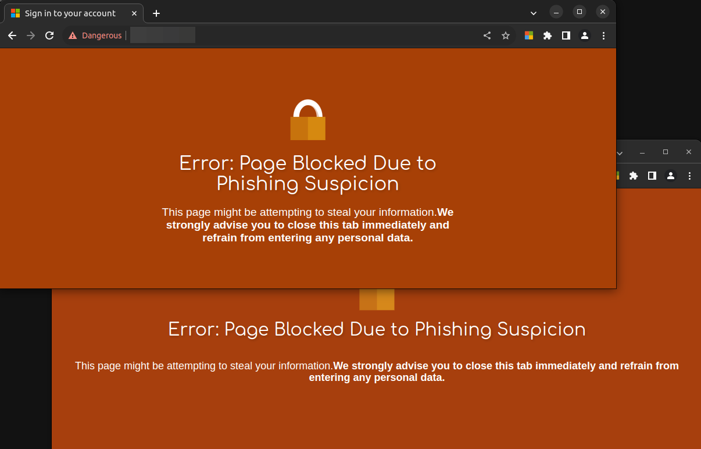

# Office365 Phishing Evilginx Detection

This extension is meticulously crafted to safeguard users from phishing attempts that replicate the Office365 login interface, particularly when adversaries employ tools such as [Evilginx](https://github.com/kgretzky/evilginx2).

## How it works:

1. The extension checks the domain and content of the current page.
2. It compares it to a list of valid Microsoft domains.
3. If it detects a suspicious page that doesn't meet the criteria of a valid Microsoft login, the extension will stop the page from loading.
4. A "Page Blocked Due to Phishing Suspicion" notification is displayed to alert the user.

## Install

1. Download/clone this repo.
2. Open the extensions page (`chrome://extensions/`).
3. Toggle on the **Developer mode** setting.
4. Click on **Load unpacked**.
5. Select the directory from this repo.

**Note:** There may be some edge cases I haven't identified, and I might update the logic above as needed. Feel free to submit a PR.

## Examples

## Fake example

## Valid example

